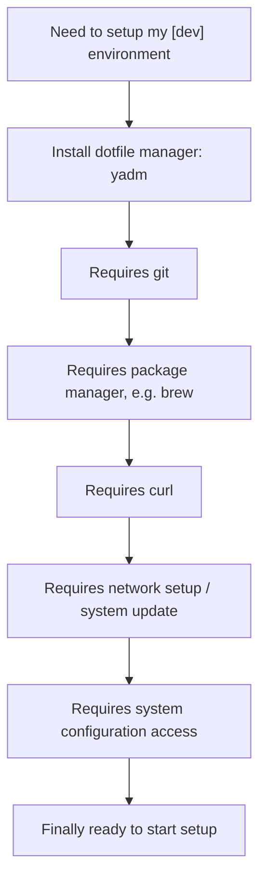

<p align="center">

<a href="https://github.com/thisismygitrepo/machineconfig/commits">

</a>

</p>


# 🧠 Welcome to **Machineconfig**

**Machineconfig** is a **Digital Life Manager** — It's called so because no existing category of software fully captures its scope.


## 💡 Motivation

But why do we need such a tool to combine all those functionalities??
Consider this concrete scenario: When setting up a new machine, VM, or Docker container, you often face dependency chains like this:



Machineconfig builds on shoulder of giants. A suite of best-in-class stack of projects on github are used, the most starred, active and written in Rust tools are used when possible. The goal is to provide a seamless experience that abstracts away the complexity of setting up and maintaining your digital environment.


## ⚙️ Functional Overview

| Category               | Comparable Tools                              | Description                                               |
|------------------------|----------------------------------------------|-----------------------------------------------------------|
| **Package Manager**     | `winget`, `apt`, `brew`, `nix`               | Installs and manages software packages across systems.    |
| **Configuration Manager** | `Ansible`, `Chef`, `Puppet`                | Configures and maintains system‐level preferences.        |
| **Automation Tool**     | `Airflow`, `Prefect`, `Dagster`, `Celery`    | Automates repetitive tasks, pipelines, orchestration.     |
| **Dotfiles Manager**    | `chezmoi`, `yadm`, `rcm`, `GNU Stow`        | Synchronises dotfiles & personal configs across systems.  |
| **Data Solution**       | `rclone`, `rsync`                            | Handles backups, mirroring and secure file sync.          |
| **Code Manager**        | `strong‐box`, `Vault`                        | Manages and protects code snippets, secrets and creds.    |

---


# Install On Windows:

```powershell
# install tool the tool only:
powershell -ExecutionPolicy ByPass -c "irm https://astral.sh/uv/install.ps1 | iex"  # Skip if UV is already installed
uv tool install --upgrade --python 3.14 machineconfig
# interactive install of machineconfig and following on to run it and make basic machine configuration (RECOMMENDED):
iex (iwr bit.ly/cfgwindows).Content  # Or, if UV is installed: iex (uvx machineconfig define)
# Quick install and configure (optionals are accepted by default):
iex (iwr bit.ly/cfgwq).Content
```


# Install On Linux and MacOS

```bash
# install the tool only:
curl -LsSf https://astral.sh/uv/install.sh | sh  # Skip if UV is already installed
uv tool install --upgrade --python 3.14 machineconfig
# interactive install of machineconfig and following on to run it and make basic machine configuration (RECOMMENDED):
. <(curl -L bit.ly/cfglinux) # Or, if UV is installed: . <(uvx machineconfig define)
```


# Author
Alex Al-Saffar. [email](mailto:programmer@usa.com)

# Contributor
Ruby Chan. [email](mailto:ruby.chan@sa.gov.au)


[](https://github.com/ashutosh00710/github-readme-activity-graph)

