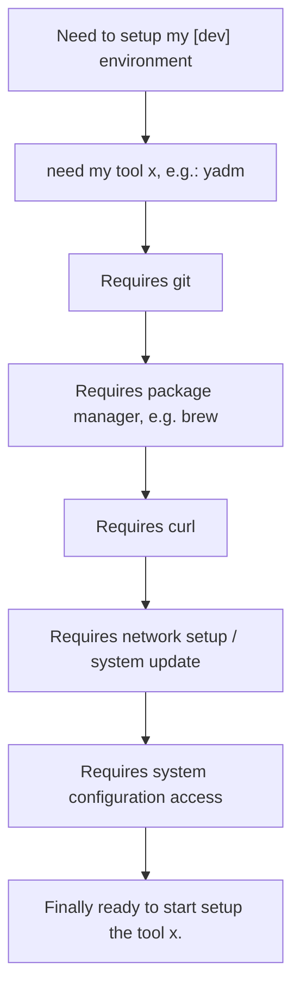

<p align="center">

<a href="https://github.com/thisismygitrepo/machineconfig/commits">

</a>

</p>


# 🧠 Welcome to **Machineconfig**

**Machineconfig** is a cli-based cross-platform **Stack Manager** — It is a swiss-army knife; a *Package Manager*, *Configuration Manager*, *Automation Tool*, *Dotfiles Manager*, *Data Solution*, and *Code Manager*, among other functionalities covered, all rolled into one seamless experience, that is consistent across different platforms.


## 💡 Motivation
Your stack is awesome, but you need stack a manager for it, to put it together and maintain it.
What is your stack? Say you have a new computer/ VM, how to set it?
* A bunch of CLI tools.
* [Optional] A bunch of softwares (GUIs for desktop environment)
* [Public] A bunch of configuration files for your tools.
* [Private] A bunch of secrets, passowords, tokens, credentials etc, etc.
* Data (Both highly sensitive and encrypted less serious unencrypted data)
* Code (your repositories).

Wouldn't be nice if you can set it all up in 2 minutes? This is a hackable tool to get it done.

Consider this concrete scenario: When setting up a new machine, VM, or Docker container, you often face dependency chains like this:



Machineconfig builds on shoulder of giants. A suite of best-in-class stack of projects on github are used, the most starred, active and written in Rust tools are used when possible. The goal is to provide a seamless experience that abstracts away the complexity of setting up and maintaining your digital environment. The goal of machineconfig is to replicate your setup, config, code, data and secrets on any machine, any os, in 5 minutes, using minimal user input. Then, from that point, machineconfig will help you maintain, update, backup and sync your digital life across all your devices, automatically.


## ⚙️ Functional Overview

| Category               | Comparable Tools                              | Description                                               |
|------------------------|----------------------------------------------|-----------------------------------------------------------|
| **Package Manager**     | `winget`, `apt`, `brew`, `nix`               | Installs and manages software packages across systems.    |
| **Configuration Manager** | `Ansible`, `Chef`, `Puppet`                | Configures and maintains system‐level preferences.        |
| **Automation Tool**     | `Airflow`, `Prefect`, `Dagster`, `Celery`    | Automates repetitive tasks, pipelines, orchestration.     |
| **Dotfiles Manager**    | `chezmoi`, `yadm`, `rcm`, `GNU Stow`        | Synchronises dotfiles & personal configs across systems.  |
| **Data Solution**       | `rclone`, `rsync`                            | Handles backups, mirroring and secure file sync.          |
| **Code Manager**        | `strong‐box`, `Vault`                        | Manages and protects code snippets, secrets and creds.    |

---


# Install On Windows:

```powershell
# install tool the tool only:
powershell -ExecutionPolicy ByPass -c "irm https://astral.sh/uv/install.ps1 | iex"  # Skip if UV is already installed
uv tool install --upgrade --python 3.14 machineconfig
# interactive install of machineconfig and following on to run it and make basic machine configuration (RECOMMENDED):
iex (iwr bit.ly/cfgwindows).Content  # Or, if UV is installed: iex (uvx machineconfig define)
# Quick install and configure (optionals are accepted by default):
iex (iwr bit.ly/cfgwq).Content
```


# Install On Linux and MacOS

```bash
# install the tool only:
curl -LsSf https://astral.sh/uv/install.sh | sh  # Skip if UV is already installed
uv tool install --upgrade --python 3.14 machineconfig
# interactive install of machineconfig and following on to run it and make basic machine configuration (RECOMMENDED):
. <(curl -L bit.ly/cfglinux) # Or, if UV is installed: . <(uvx machineconfig define)
```


# Author
Alex Al-Saffar. [email](mailto:programmer@usa.com)

# Contributor
Ruby Chan. [email](mailto:ruby.chan@sa.gov.au)


[](https://github.com/ashutosh00710/github-readme-activity-graph)

