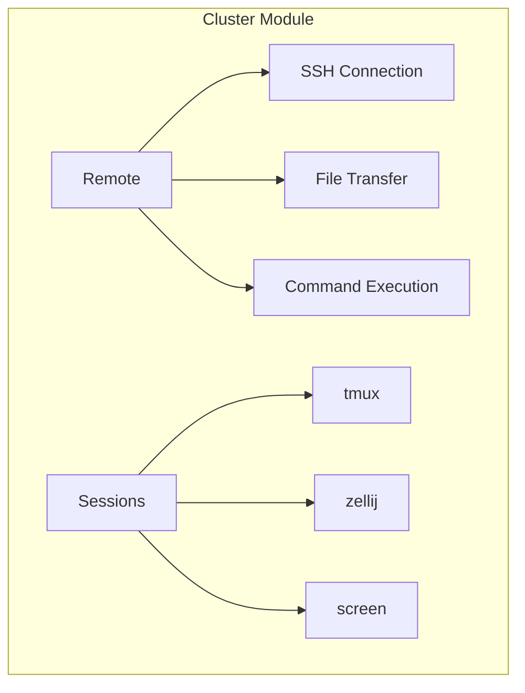

# Cluster Module

The `cluster` module provides functionality for managing remote machines and distributed operations.

---

## Overview

```python
from machineconfig import cluster
```

---

## Submodules

### Remote

Handles remote machine connectivity and operations:

- SSH connections
- File transfers
- Command execution
- Job distribution

[:octicons-arrow-right-24: Remote Documentation](remote.md)

### Sessions Managers

Manages terminal sessions:

- Session creation and management
- Multiplexer integration (tmux, zellij)
- Persistent sessions

[:octicons-arrow-right-24: Sessions Documentation](sessions.md)

---

## Architecture


