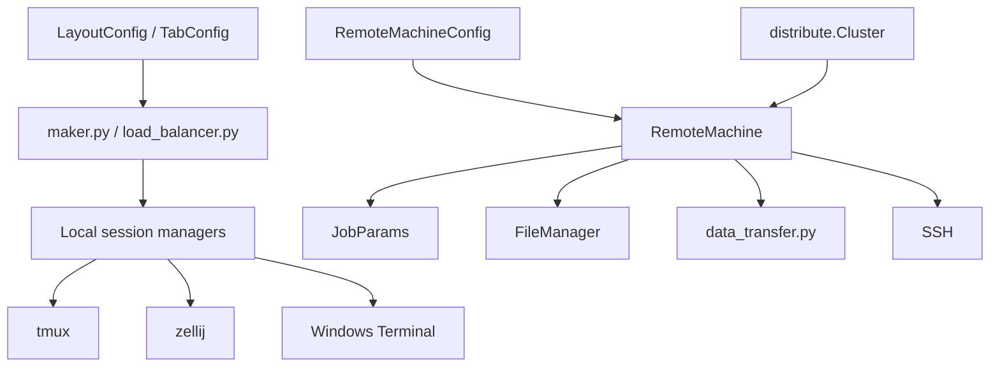

# Cluster API

`machineconfig.cluster` is the orchestration layer of the library. It combines:

- typed layout definitions
- local and remote session managers
- remote job packaging, transfer, launch, and status tracking

Most higher-level automation code in this area moves through those three pieces in that order.

---

## Topics in this section

| Topic | What it covers | Main modules |
| --- | --- | --- |
| [Layouts](layouts.md) | Layout schema, callable-to-tab builders, layout splitting, backend-specific launchers | `machineconfig.utils.schemas.layouts.layout_types`, `machineconfig.cluster.sessions_managers.utils.maker`, `machineconfig.cluster.sessions_managers.utils.load_balancer`, `machineconfig.cluster.sessions_managers.{zellij,tmux,windows_terminal}.*` |
| [Sessions](sessions.md) | Conflict planning plus local and remote session managers for zellij, tmux, and Windows Terminal | `machineconfig.cluster.sessions_managers.session_conflict`, `machineconfig.cluster.sessions_managers.*_manager` |
| [Remote execution and networking](remote.md) | Remote job models, generated scripts, file transfer, SSH helpers, workload distribution, address helpers | `machineconfig.cluster.remote.*`, `machineconfig.utils.ssh`, `machineconfig.scripts.python.helpers.helpers_network.*` |

---

## Architecture


```mermaid
graph TB
    A[LayoutConfig / TabConfig] --> B[maker.py / load_balancer.py]
    B --> C[Local session managers]
    C --> D[tmux]
    C --> E[zellij]
    C --> F[Windows Terminal]

    G[RemoteMachineConfig] --> H[RemoteMachine]
    H --> I[JobParams]
    H --> J[FileManager]
    H --> K[data_transfer.py]
    H --> L[SSH]

    M[distribute.Cluster] --> H
```

---

## Common import patterns

```python
from machineconfig.cluster.remote.distribute import Cluster
from machineconfig.cluster.remote.models import RemoteMachineConfig
from machineconfig.cluster.remote.remote_machine import RemoteMachine
from machineconfig.cluster.sessions_managers.tmux.tmux_local_manager import TmuxLocalManager
from machineconfig.cluster.sessions_managers.zellij.zellij_local_manager import ZellijLocalManager
from machineconfig.cluster.sessions_managers.utils.maker import make_layout_from_functions
from machineconfig.utils.schemas.layouts.layout_types import LayoutConfig
```
