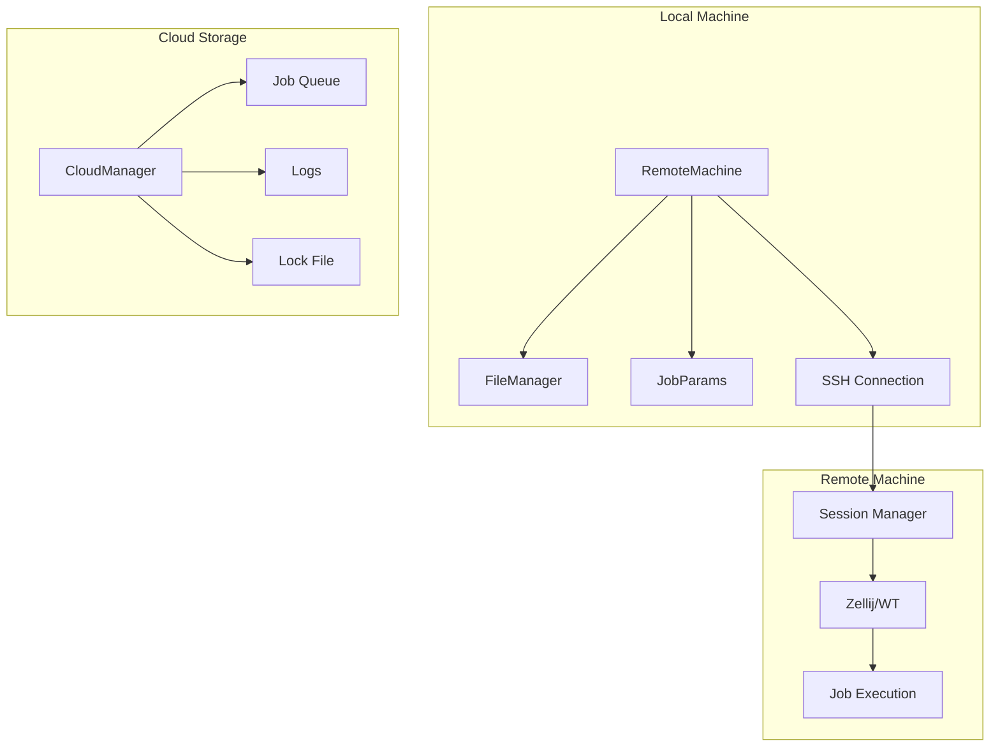

# Remote Module

The `remote` subpackage provides functionality for remote machine connectivity and distributed job execution.

---

## Overview

The remote module handles:

- **SSH Connections** - Secure shell connections to remote machines
- **File Transfers** - Upload and download files between machines
- **Command Execution** - Run commands on remote systems
- **Job Distribution** - Distribute and manage jobs across clusters
- **Cloud Integration** - Sync job state via cloud storage (rclone)

---

## Architecture



---

## Available Modules

| Module | Description |
|--------|-------------|
| `remote_machine` | Core `RemoteMachine` class for job submission and execution |
| `file_manager` | Manages job files, scripts, and execution logs |
| `job_params` | Job parameter configuration and serialization |
| `data_transfer` | File transfer utilities (upload/download) |
| `distribute` | Job distribution across multiple machines |
| `run_cluster` | Cluster-wide execution orchestration |
| `cloud_manager` | Cloud-based job queue management |
| `loader_runner` | Job loading and execution runtime |

---

## RemoteMachine Class

The `RemoteMachine` class is the primary interface for remote job execution:

```python
from machineconfig.cluster.remote.remote_machine import RemoteMachine
from machineconfig.cluster.remote.loader_runner import RemoteMachineConfig

# Configure remote execution
config = RemoteMachineConfig(
    job_id="my-job",
    ssh_params={"host": "server.example.com", "username": "user"},
    base_dir="~/jobs",
)

# Create remote machine instance
rm = RemoteMachine(
    func="path/to/script.py::main_function",
    config=config,
    func_kwargs={"param1": "value1"},
)

# Execute the job
rm.run(run=True, open_console=True)
```

### Key Methods

| Method | Description |
|--------|-------------|
| `generate_scripts()` | Generate execution scripts for the job |
| `submit()` | Submit job files to remote machine |
| `fire()` | Launch job execution in a terminal session |
| `run()` | Complete workflow: generate, submit, and fire |

---

## FileManager

Manages the job file structure on remote machines:

```
~/jobs/{job_id}/
├── data/
│   ├── remote_machine.Machine.pkl
│   └── input_data/
├── scripts/
│   ├── run.sh
│   └── run.py
└── logs/
    ├── status.txt
    ├── pid.txt
    └── output.log
```

---

## CloudManager

!!! warning "Experimental"
    The CloudManager is currently under development and may change.

Enables distributed job execution using cloud storage as a coordination layer:

- **Job Queue** - Jobs are queued and picked up by available workers
- **Distributed Locking** - Prevents race conditions with cloud-based locks
- **Status Monitoring** - Track job status across multiple machines

---

## Session Backends

Jobs are executed within terminal multiplexer sessions:

| Platform | Backend |
|----------|---------|
| Linux/macOS | Zellij |
| Windows | Windows Terminal |

This enables:

- Persistent sessions that survive SSH disconnections
- Job monitoring through the terminal interface
- Multiple jobs in separate tabs/panes

---

## Usage Example

### Simple Remote Execution

```bash
# Using the sessions CLI
sessions exec "python script.py" --host server1
```

### Cluster Execution

```bash
# Execute across multiple machines
croshell cluster-exec "apt update" --targets server1,server2,server3
```

---

## Configuration

Remote connections are configured via SSH:

```python
ssh_params = {
    "host": "server.example.com",
    "username": "user",
    "key_filename": "~/.ssh/id_rsa",
    "port": 22,
}
```

Or use existing SSH config entries:

```python
ssh_params = {
    "host": "my-server",  # References ~/.ssh/config entry
}
```

---

## See Also

- [Sessions Documentation](sessions.md) - Terminal session management
- [CLI Sessions Reference](../../cli/sessions.md) - Command-line interface
