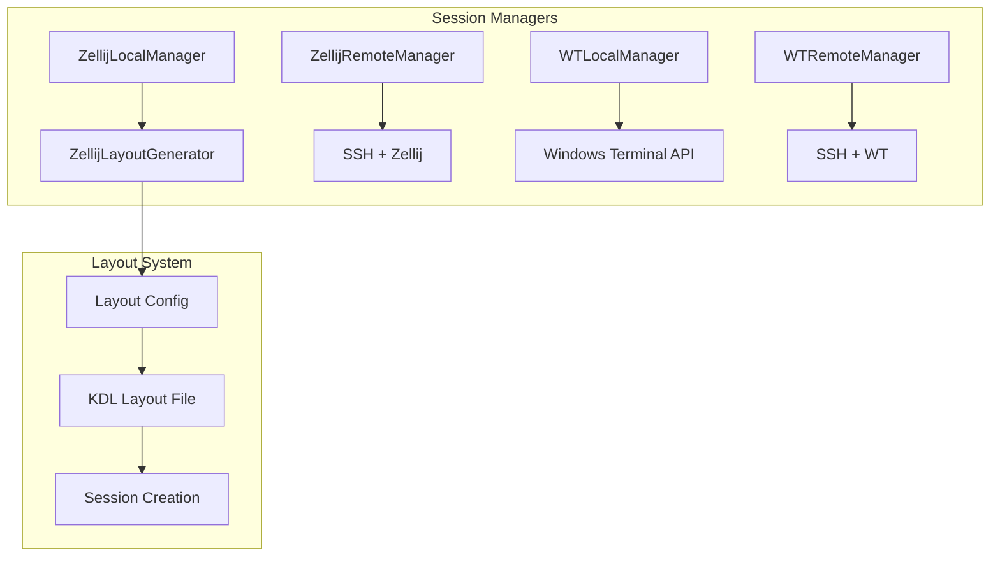

# Sessions Managers

The `sessions_managers` subpackage provides terminal session management functionality for both local and remote machines.

---

## Overview

Manages terminal multiplexer sessions using platform-specific backends:

- **Zellij** - Modern terminal workspace for Linux/macOS
- **Windows Terminal** - Native Windows terminal multiplexing

---

## Architecture



---

## Session Managers

| Module | Platform | Scope | Description |
|--------|----------|-------|-------------|
| `zellij_local_manager` | Linux/macOS | Local | Manage local Zellij sessions |
| `zellij_remote_manager` | Linux/macOS | Remote | Manage Zellij sessions over SSH |
| `wt_local_manager` | Windows | Local | Manage local Windows Terminal sessions |
| `wt_remote_manager` | Windows | Remote | Manage Windows Terminal sessions over SSH |

---

## ZellijLocalManager

Manages multiple local Zellij sessions with layout support:

```python
from machineconfig.cluster.sessions_managers.zellij_local_manager import ZellijLocalManager
from machineconfig.utils.schemas.layouts.layout_types import LayoutConfig

# Define session layouts
layouts: list[LayoutConfig] = [
    {
        "layoutName": "Development",
        "tabs": [
            {"tabName": "editor", "command": "hx ."},
            {"tabName": "terminal", "command": ""},
            {"tabName": "logs", "command": "tail -f /var/log/syslog"},
        ]
    }
]

# Create manager
manager = ZellijLocalManager(session_layouts=layouts)

# Start all sessions
results = manager.start_all_sessions(poll_seconds=10, poll_interval=0.5)

# Get session names
sessions = manager.get_all_session_names()
```

### Key Features

| Feature | Description |
|---------|-------------|
| Multi-session management | Manage multiple named sessions simultaneously |
| Layout templates | Define tab layouts with commands |
| Process monitoring | Track running processes in each tab |
| Non-blocking startup | Sessions start in background |

---

## ZellijLayoutGenerator

Generates Zellij layout files (KDL format) from configuration:

```python
from machineconfig.cluster.sessions_managers.zellij_local import ZellijLayoutGenerator

layout_config = {
    "layoutName": "MyLayout",
    "tabs": [
        {"tabName": "main", "command": "htop"},
        {"tabName": "shell", "command": ""},
    ]
}

generator = ZellijLayoutGenerator(
    layout_config=layout_config,
    session_name="my-session"
)

# Create layout file
generator.create_layout_file()

# Get layout path
print(generator.layout_path)
```

---

## Windows Terminal Manager

For Windows environments, the WT managers provide similar functionality:

```python
from machineconfig.cluster.sessions_managers.wt_local_manager import WTLocalManager

# Windows Terminal session management
manager = WTLocalManager(session_configs=configs)
manager.start_sessions()
```

---

## Utility Modules

### Process Monitoring

Track processes running in session tabs:

```python
from machineconfig.cluster.sessions_managers.zellij_utils.process_monitor import ProcessMonitor

monitor = ProcessMonitor(session_name="my-session")
status = monitor.get_tab_status("editor")
```

### Status Reporting

Generate status reports for running sessions:

```python
from machineconfig.cluster.sessions_managers.zellij_utils.status_reporter import StatusReporter

reporter = StatusReporter()
report = reporter.generate_report(session_names=["session1", "session2"])
```

---

## Layout Configuration

Layouts are defined using `LayoutConfig` TypedDict:

```python
from machineconfig.utils.schemas.layouts.layout_types import LayoutConfig

config: LayoutConfig = {
    "layoutName": "Development Environment",
    "tabs": [
        {
            "tabName": "code",
            "command": "hx .",
            "cwd": "~/projects/myapp",  # optional
        },
        {
            "tabName": "server",
            "command": "python -m http.server 8000",
        },
        {
            "tabName": "tests",
            "command": "pytest --watch",
        },
    ]
}
```

---

## CLI Integration

Session managers integrate with the `sessions` CLI:

```bash
# List active sessions
sessions list

# Create session with layout
sessions create dev --layout development

# Attach to session
sessions attach dev

# Kill session
sessions kill dev
```

---

## Platform Support

| Platform | Session Manager | Terminal |
|----------|-----------------|----------|
| Linux | Zellij | Any terminal |
| macOS | Zellij | Any terminal |
| Windows | Windows Terminal | Windows Terminal |
| WSL | Zellij | Windows Terminal + WSL |

!!! note "Zellij Requirement"
    Linux/macOS session management requires [Zellij](https://zellij.dev/) to be installed.
    Install via: `cargo install zellij` or your package manager.

---

## See Also

- [Remote Module Documentation](remote.md) - Remote machine operations
- [CLI Sessions Reference](../../cli/sessions.md) - Command-line interface
