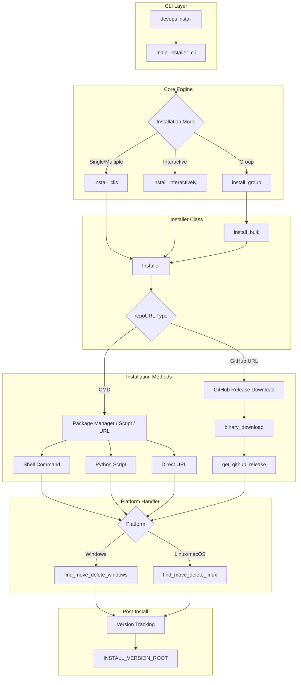

# Installer Module

The `installer` subpackage is a comprehensive cross-platform package installation system that provides unified installation capabilities across Linux, macOS, and Windows.

---

## Quick Start

```bash
# Install a single package
devops install btop

# Install multiple packages
devops install btop,fd,bat,rg

# Install a package group
devops install termabc --group

# Interactive package selection (with TV/fzf interface)
devops install --interactive
```

---

## Architecture Overview

The installer system consists of several interconnected components:



---

## Installation Methods

The installer supports multiple installation strategies based on the `repoURL` field in the installer data:

### Method 1: Package Manager Commands (`repoURL: "CMD"`)

When `repoURL` is `"CMD"`, the `fileNamePattern` contains the actual installation command or script reference.

#### Shell Commands

Direct package manager commands:

```json
{
  "appName": "git",
  "repoURL": "CMD",
  "doc": "Distributed version control system",
  "fileNamePattern": {
    "amd64": {
      "linux": "sudo nala install git",
      "windows": "winget install --no-upgrade --name \"Git\" --Id \"Git.Git\" --source winget --scope user --accept-package-agreements --accept-source-agreements",
      "macos": "brew install git"
    }
  }
}
```

**Supported Package Managers:**

| Platform | Package Managers |
|----------|-----------------|
| Linux | `apt`, `nala`, `snap`, `cargo`, `pip`, `npm`, `bun` |
| macOS | `brew`, `cargo`, `pip`, `npm`, `bun` |
| Windows | `winget`, `scoop`, `cargo`, `pip`, `npm`, `bun` |

#### Python Scripts (`.py`)

For complex installations requiring custom logic:

```json
{
  "appName": "yazi",
  "repoURL": "CMD",
  "fileNamePattern": {
    "amd64": {
      "linux": "yazi.py",
      "windows": "yazi.py",
      "macos": "yazi.py"
    }
  }
}
```

The Python script must implement a `main(installer_data: InstallerData, version: Optional[str])` function.

#### Shell Scripts (`.sh`)

For Linux/macOS platform-specific installations:

```json
{
  "appName": "brave",
  "repoURL": "CMD",
  "fileNamePattern": {
    "amd64": {
      "linux": "brave.sh"
    }
  }
}
```

#### PowerShell Scripts (`.ps1`)

For Windows-specific installations:

```json
{
  "fileNamePattern": {
    "amd64": {
      "windows": "install_fonts.ps1"
    }
  }
}
```

#### Direct URLs

Direct download URLs for pre-built binaries:

```json
{
  "appName": "speedtest",
  "repoURL": "CMD",
  "fileNamePattern": {
    "amd64": {
      "linux": "https://install.speedtest.net/app/cli/ookla-speedtest-1.2.0-linux-x86_64.tgz"
    }
  }
}
```

### Method 2: GitHub Releases (`repoURL: "https://github.com/..."`)

Automatic download from GitHub releases with version pattern matching:

```json
{
  "appName": "btop",
  "repoURL": "https://github.com/aristocratos/btop",
  "doc": "Resource monitor for Linux, FreeBSD and MacOS",
  "fileNamePattern": {
    "amd64": {
      "linux": "btop-x86_64-linux-musl.tbz",
      "macos": null,
      "windows": null
    },
    "arm64": {
      "linux": "btop-aarch64-linux-musl.tbz"
    }
  }
}
```

**Version Templating:**

Use `{version}` placeholder for version-specific filenames:

```json
{
  "fileNamePattern": {
    "amd64": {
      "linux": "mprocs-{version}-linux-x86_64-musl.tar.gz"
    }
  }
}
```

The system automatically:

1. Fetches the latest release from GitHub API
2. Extracts the version tag (e.g., `v0.6.4`)
3. Replaces `{version}` in the pattern
4. Downloads the matching asset

---

## InstallerData Schema

The core data structure for package definitions:

```python
class InstallerData(TypedDict):
    appName: str                    # Display name (also used for executable lookup)
    doc: str                        # Description shown in interactive mode
    repoURL: str                    # "CMD" or GitHub repository URL
    fileNamePattern: dict[          # Platform-specific installation patterns
        CPU_ARCHITECTURES,          # "amd64" | "arm64"
        dict[
            OPERATING_SYSTEMS,      # "windows" | "linux" | "macos"
            Optional[str]           # Installation pattern or None if unsupported
        ]
    ]
```

**Field Details:**

| Field | Type | Description |
|-------|------|-------------|
| `appName` | `str` | Package identifier. Lowercase version becomes the executable name |
| `doc` | `str` | Description displayed during interactive selection |
| `repoURL` | `str` | Either `"CMD"` for command-based install or a GitHub URL |
| `fileNamePattern` | `dict` | Nested dict mapping arch -> os -> installation pattern |

**Architecture Values:**

- `amd64`: Intel/AMD 64-bit (x86_64)
- `arm64`: ARM 64-bit (aarch64)

**Operating System Values:**

- `windows`: Microsoft Windows
- `linux`: Linux distributions
- `macos`: macOS (Darwin)

---

## Installer Class

The main installation orchestrator:

```python
from machineconfig.utils.installer_utils.installer_class import Installer
from machineconfig.utils.schemas.installer.installer_types import InstallerData

installer_data: InstallerData = {
    "appName": "fd",
    "repoURL": "https://github.com/sharkdp/fd",
    "doc": "A simple, fast and user-friendly alternative to find",
    "fileNamePattern": {
        "amd64": {
            "linux": "fd-v{version}-x86_64-unknown-linux-musl.tar.gz",
            "windows": "fd-v{version}-x86_64-pc-windows-msvc.zip",
            "macos": "fd-v{version}-x86_64-apple-darwin.tar.gz"
        },
        "arm64": {
            "linux": "fd-v{version}-aarch64-unknown-linux-musl.tar.gz",
            "macos": "fd-v{version}-aarch64-apple-darwin.tar.gz",
            "windows": None
        }
    }
}

installer = Installer(installer_data)
```

### Methods

#### `install(version: Optional[str]) -> None`

Main installation method. Handles all installation strategies.

```python
installer.install(version=None)      # Install latest
installer.install(version="v9.0.0")  # Install specific version
```

#### `install_robust(version: Optional[str]) -> str`

Wrapped installation with error handling. Returns status message.

```python
status = installer.install_robust(version=None)
# Returns: "fd updated from v8.7.0 -> v9.0.0"
# Or: "fd, same version: v9.0.0"
# Or: "Failed to install `fd` with error: ..."
```

#### `binary_download(version: Optional[str]) -> tuple[PathExtended, str]`

Downloads and extracts the binary without installing.

```python
extracted_path, version = installer.binary_download(version=None)
# extracted_path: PathExtended to extracted files
# version: Actual version string (e.g., "v9.0.0")
```

#### `get_github_release(repo_url: str, version: Optional[str]) -> tuple[Optional[str], Optional[str]]`

Retrieves download URL and version from GitHub API.

```python
download_url, version = installer.get_github_release(
    repo_url="https://github.com/sharkdp/fd",
    version=None  # or specific version
)
```

#### `get_description() -> str`

Returns formatted description for interactive selection.

```python
desc = installer.get_description()
# "fd           ✅ A simple, fast and user-friendly alternative to find"
```

---

## Package Groups

Pre-defined collections of related packages for bulk installation.

### Available Groups

| Group | Description | Package Count |
|-------|-------------|---------------|
| `sysabc` | System essentials (package managers, build tools) | 1 (meta-package) |
| `termabc` | Terminal power tools (40+ tools) | ~60 |
| `gui` | GUI applications (browsers, editors) | 3 |
| `dev` | Full development environment | ~80 |
| `dev-utils` | Development utilities | 4 |
| `term-eye-candy` | Terminal visual enhancements | 4 |
| `agents` | AI/LLM coding assistants | 15+ |
| `terminal-emulator` | Terminal emulators | 6 |
| `shell` | Shell enhancements | 9 |
| `browsers` | Web browsers | 6 |
| `code-editors` | Code editors and IDEs | 3 |
| `code-analysis` | Code analysis and Git tools | 14 |
| `db` | Database tools | 8 |
| `media` | Media players | 5 |
| `file-sharing` | File sharing and cloud tools | 17 |
| `productivity` | Productivity tools | 12 |
| `sys-monitor` | System monitors | 11 |
| `search` | File search and navigation | 22 |

### Group Contents

#### `agents` - AI/LLM Coding Assistants

```
aider, aichat, copilot, gemini, crush, opencode-ai, chatgpt, mods, q, 
qwen-code, cursor-cli, droid, kilocode, cline, auggie
```

#### `termabc` - Terminal Essentials

Combines: `code-analysis` + `sys-monitor` + `shell` + `search`

```
# Code Analysis
nano, lazygit, onefetch, gitcs, lazydocker, hyperfine, kondo, tokei, 
navi, tealdeer, gitui, delta, gh, watchexec, jq

# System Monitors
btop, btm, ntop, procs, bandwhich, ipinfo, sniffnet, cpufetch, 
fastfetch, topgrade, speedtest

# Shell Enhancements
zellij, mprocs, mcfly, atuin, starship, gotty, ttyd, rclone, cb

# Search & File Tools
nerdfont, fd, fzf, tv, broot, rg, rga, ugrep, ouch, pistol, bat, viu,
yazi, tere, lsd, zoxide, diskonaut, dua, dust, cpz, rmz
```

#### `terminal-emulator` - Terminal Emulators

```
Alacritty, Wezterm, warp, vtm, edex-ui, extraterm, nushell
```

#### `code-editors` - Code Editors

```
code (VS Code), Cursor, lvim (LunarVim)
```

#### `db` - Database Tools

```
SqliteBrowser, sqlite3, redis, redis-cli, postgresql-client, duckdb, 
DBeaver, rainfrog
```

### Installing Groups

```bash
# Install terminal essentials
devops install termabc --group
devops install termabc -g

# Install AI assistants
devops install agents -g

# Install full dev environment
devops install dev -g
```

---

## Custom Python Installers

For packages requiring complex installation logic, custom Python scripts are provided in `jobs/installer/python_scripts/`.

### Available Custom Installers

| Package | Script | Description |
|---------|--------|-------------|
| `alacritty` | `alacritty.py` | Terminal emulator with theme setup |
| `brave` | `brave.py` | Brave browser with platform-specific methods |
| `boxes` | `boxes.py` | ASCII box drawing tool (Windows binary) |
| `bypass_paywall` | `bypass_paywall.py` | Chrome extension for bypassing paywalls |
| `cloudflare_warp_cli` | `cloudflare_warp_cli.py` | Cloudflare WARP VPN client |
| `code` | `code.py` | VS Code with official installation scripts |
| `cursor` | `cursor.py` | Cursor IDE (AppImage on Linux, exe on Windows) |
| `dubdb_adbc` | `dubdb_adbc.py` | DuckDB ADBC library |
| `espanso` | `espanso.py` | Text expander with Wayland/X11 detection |
| `gh` | `gh.py` | GitHub CLI with Copilot extension |
| `goes` | `goes.py` | Gorilla (natural language to API) |
| `hx` | `hx.py` | Helix editor with runtime and LSP setup |
| `lvim` | `lvim.py` | LunarVim with official installer |
| `nerdfont` | `nerdfont.py` | Nerd Fonts (cross-platform) |
| `redis` | `redis.py` | Redis server |
| `sysabc` | `sysabc.py` | System essentials meta-installer |
| `wezterm` | `wezterm.py` | WezTerm terminal emulator |
| `winget` | `winget.py` | Windows Package Manager bootstrap |
| `yazi` | `yazi.py` | File manager with plugins and flavors |

### Custom Installer Interface

All custom installers follow this pattern:

```python
from typing import Optional
from machineconfig.utils.schemas.installer.installer_types import InstallerData

def main(installer_data: InstallerData, version: Optional[str]) -> None:
    """
    Main entry point for custom installation.
    
    Args:
        installer_data: The installer configuration from installer_data.json
        version: Specific version to install, or None for latest
    """
    # Platform detection
    import platform
    system = platform.system()  # "Windows", "Linux", "Darwin"
    
    # Installation logic...
```

### Example: Helix Editor Installer

The `hx.py` installer demonstrates a complex installation:

1. Downloads from GitHub releases
2. Extracts executable, runtime, and contrib directories
3. Installs grammar files for supported languages
4. Handles Windows and Unix paths differently

```python
# Supported languages for grammar installation
LANGUAGES_SUPPORTED = ["python", "nu", "bash", "lua", "powershell"]

def main(installer_data: InstallerData, version: Optional[str], install_lib: bool = True):
    # Download binary
    downloaded, _version = inst.binary_download(version=version)
    
    # Install executable
    hx_file.move(folder=target_bin_path, overwrite=True)
    
    # Install runtime (selectively for supported languages)
    if install_lib:
        for child in runtime.iterdir():
            if child.name == "grammars":
                for lang in LANGUAGES_SUPPORTED:
                    lang_file = child.joinpath(f"{lang}.so")
                    if lang_file.exists():
                        lang_file.copy(folder=target_runtime.joinpath("grammars"))
```

---

## Platform-Specific Behavior

### Installation Paths

| Platform | Binary Path | Config Path |
|----------|-------------|-------------|
| Windows | `%LOCALAPPDATA%\Microsoft\WindowsApps` | `%APPDATA%` |
| Linux | `~/.local/bin` | `~/.config` |
| macOS | `/usr/local/bin` | `~/.config` |

### Executable Handling

**Windows:**
```python
def find_move_delete_windows(downloaded_file_path, tool_name, delete, rename_to):
    # Finds .exe in downloaded archive
    # Moves to WindowsApps directory
    # Handles renaming if needed
```

**Linux/macOS:**
```python
def find_move_delete_linux(downloaded, tool_name, delete, rename_to):
    # Finds binary in extracted archive
    # Sets executable permissions (chmod 777)
    # Uses sudo for /usr/local/bin
    # Moves to installation path
```

---

## Version Tracking

Installed versions are tracked in `~/.config/machineconfig/install_versions/`:

```
~/.config/machineconfig/install_versions/
├── btop
├── fd
├── rg
└── yazi
```

Each file contains the installed version string.

### Checking Installation Status

```python
from machineconfig.utils.installer_utils.installer_locator_utils import check_if_installed_already

verdict, current_ver, new_ver = check_if_installed_already(
    exe_name="fd",
    version="v9.0.0",
    use_cache=False
)
# verdict: "✅ Up to date" | "❌ Outdated" | "⚠️ NotInstalled"
```

---

## Bulk Installation

Install multiple packages in parallel:

```python
from machineconfig.utils.installer_utils.installer_runner import install_bulk, get_installers
from machineconfig.utils.schemas.installer.installer_types import get_os_name, get_normalized_arch

# Get all installers for current platform
installers = get_installers(
    os=get_os_name(),
    arch=get_normalized_arch(),
    which_cats=["termabc"]  # or None for all
)

# Install with parallel processing
install_bulk(
    installers_data=installers,
    safe=False,
    jobs=10,      # Parallel workers
    fresh=False   # Don't clear version cache
)
```

---

## VirusTotal Integration

The `checks` submodule provides security scanning for installed binaries.

### Scanning Workflow


### Usage

```python
from machineconfig.jobs.installer.checks.check_installations import main

# Run full scan
main()
# Outputs:
#   - ~/.config/machineconfig/profile/records/{platform}/apps_summary_report.csv
#   - ~/.config/machineconfig/profile/records/{platform}/apps_summary_report.md
```

### Configuration

VirusTotal API token must be stored at:
```
~/dotfiles/creds/tokens/virustotal
```

### Report Format

```markdown
| App Name | Version | Positive Pct | Scan Time | App Path | App URL |
|----------|---------|--------------|-----------|----------|---------|
| fd       | 9.0.0   | 0.0          | 2024-01-15 | ~/.local/bin/fd | ... |
```

---

## CLI Reference

### `devops install`

Main installation command.

```bash
devops install [OPTIONS] [WHICH]
```

**Arguments:**

| Argument | Description |
|----------|-------------|
| `WHICH` | Comma-separated package names or group name |

**Options:**

| Option | Short | Description |
|--------|-------|-------------|
| `--group` | `-g` | Treat `WHICH` as a group name |
| `--interactive` | `-i` | Interactive selection mode |

**Examples:**

```bash
# Single package
devops install btop

# Multiple packages
devops install btop,fd,bat,rg,fzf

# Package group
devops install termabc -g

# Interactive mode (with fzf/TV interface)
devops install -i

# Install from GitHub URL directly
devops install https://github.com/sharkdp/fd

# Install from direct binary URL
devops install https://example.com/tool-v1.0-linux-amd64.tar.gz
```

### Interactive Mode Features

When using `--interactive`:

1. Shows all available packages with installation status (✅/❌)
2. Displays package descriptions
3. Allows multi-select with TV/fzf interface
4. Groups are prefixed with 📦 for easy identification

---

## Adding New Packages

### Step 1: Edit `installer_data.json`

```json
{
  "appName": "mytool",
  "repoURL": "https://github.com/user/mytool",
  "doc": "Description of what mytool does",
  "fileNamePattern": {
    "amd64": {
      "linux": "mytool-{version}-linux-amd64.tar.gz",
      "windows": "mytool-{version}-windows-amd64.zip",
      "macos": "mytool-{version}-darwin-amd64.tar.gz"
    },
    "arm64": {
      "linux": "mytool-{version}-linux-arm64.tar.gz",
      "windows": null,
      "macos": "mytool-{version}-darwin-arm64.tar.gz"
    }
  }
}
```

### Step 2: Add to Package Groups (Optional)

Edit `jobs/installer/package_groups.py`:

```python
PACKAGES_DEV_UTILS = [
    "devcontainer",
    "rust-analyzer",
    "mytool",  # Add here
]
```

### Step 3: Create Custom Installer (If Needed)

For complex installations, create `jobs/installer/python_scripts/mytool.py`:

```python
from typing import Optional
from machineconfig.utils.schemas.installer.installer_types import InstallerData

def main(installer_data: InstallerData, version: Optional[str]) -> None:
    # Custom installation logic
    pass
```

---

## Troubleshooting

### Common Issues

**Package not found:**
```
❌ 'mypackage' was not found.
🤔 Did you mean one of these?
```

The system uses fuzzy matching to suggest alternatives.

**GitHub rate limit:**
```
🚫 Rate limit exceeded
```

Wait 60 minutes or authenticate with a GitHub token.

**Permission denied on Linux:**
```
❌ MOVING executable failed
```

The installer uses `sudo` for `/usr/local/bin`. Ensure sudo access.

**Windows execution policy:**
```
Script execution is disabled
```

Run: `Set-ExecutionPolicy -ExecutionPolicy RemoteSigned -Scope CurrentUser`

### Debug Mode

Check installed versions cache:
```bash
ls ~/.config/machineconfig/install_versions/
cat ~/.config/machineconfig/install_versions/btop
```

Clear version cache for fresh install:
```python
from machineconfig.utils.installer_utils.installer_runner import install_bulk
install_bulk(installers, fresh=True)  # Clears cache
```

---

## API Reference

### Core Functions

```python
# Main CLI entry point
from machineconfig.utils.installer_utils.installer_cli import main_installer_cli

# Install specific packages
from machineconfig.utils.installer_utils.installer_cli import install_clis
install_clis(clis_names=["btop", "fd", "bat"])

# Install package group
from machineconfig.utils.installer_utils.installer_cli import install_group
install_group(package_group="termabc")

# Interactive installation
from machineconfig.utils.installer_utils.installer_cli import install_interactively
install_interactively()

# Install if not present
from machineconfig.utils.installer_utils.installer_cli import install_if_missing
install_if_missing("git")  # Returns True if available after call
```

### Utility Functions

```python
# Check if tool exists
from machineconfig.utils.installer_utils.installer_locator_utils import check_tool_exists
exists = check_tool_exists("fd")

# Get all installers for platform
from machineconfig.utils.installer_utils.installer_runner import get_installers
installers = get_installers(os="linux", arch="amd64", which_cats=None)

# Get installed CLI apps
from machineconfig.utils.installer_utils.installer_runner import get_installed_cli_apps
apps = get_installed_cli_apps()

# Install from GitHub URL
from machineconfig.utils.installer_utils.install_from_url import install_from_github_url
install_from_github_url("https://github.com/user/repo")

# Install from binary URL
from machineconfig.utils.installer_utils.install_from_url import install_from_binary_url
install_from_binary_url("https://example.com/tool.tar.gz")
```

### Type Definitions

```python
from machineconfig.utils.schemas.installer.installer_types import (
    InstallerData,           # Package definition
    InstallerDataFiles,      # installer_data.json structure
    CPU_ARCHITECTURES,       # "amd64" | "arm64"
    OPERATING_SYSTEMS,       # "windows" | "linux" | "macos"
    get_os_name,             # Get current OS
    get_normalized_arch,     # Get current architecture
)
```
