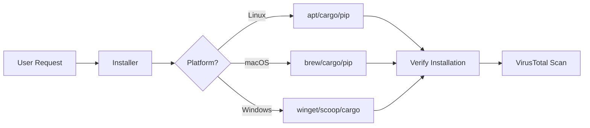

# Installer Module

The `installer` subpackage handles cross-platform package installation and verification.

---

## Overview

The installer provides:

- **Package Detection** - Check if packages are installed
- **Cross-Platform Installation** - Unified interface for apt, brew, scoop, winget, cargo, npm, pip
- **Installation Verification** - Verify successful installations
- **Package Groups** - Curated collections for common use cases
- **VirusTotal Integration** - Security scanning for installed binaries

---

## Architecture



---

## Package Groups

::: machineconfig.jobs.installer.package_groups
    options:
      show_root_heading: false
      show_source: false
      members_order: source
      show_docstring_description: true

### Group Reference

| Group Name | Description |
|------------|-------------|
| `sysabc` | System ABC utilities |
| `termabc` | Terminal essentials (search, monitors, shell) |
| `gui` | GUI applications |
| `dev` | Full development environment |
| `dev-utils` | Development utilities |
| `term-eye-candy` | Terminal visual enhancements |
| `agents` | AI/LLM coding assistants |
| `terminal-emulator` | Terminal emulators |
| `shell` | Shell enhancements |
| `browsers` | Web browsers |
| `code-editors` | Code editors and IDEs |
| `code-analysis` | Code analysis tools |
| `db` | Database tools |
| `media` | Media players |
| `file-sharing` | File sharing and cloud tools |
| `productivity` | Productivity tools |
| `sys-monitor` | System monitors |
| `search` | File search tools |

---

## Installation Data

Packages are defined in `installer_data.json` with platform-specific installation commands:

```json
{
  "appName": "btop",
  "description": "Resource monitor that shows usage and stats",
  "platforms": {
    "linux": {
      "apt": "btop",
      "cargo": "btop",
      "snap": "btop"
    },
    "darwin": {
      "brew": "btop"
    },
    "windows": {
      "scoop": "btop",
      "winget": "aristocratos.btop"
    }
  },
  "checkCommand": "btop --version",
  "category": "system-monitor"
}
```

---

## Installation Checks

The `checks` submodule provides installation verification:

```python
from machineconfig.jobs.installer.checks import check_installations

# Check if packages are installed
results = check_installations.check_packages(["btop", "htop", "fd"])
for pkg, installed in results.items():
    print(f"{pkg}: {'Installed' if installed else 'Missing'}")
```

### VirusTotal Integration

Scan installed binaries for security:

```python
from machineconfig.jobs.installer.checks import vt_utils

# Scan a binary
result = vt_utils.scan_binary("/usr/bin/btop")
print(f"Detection ratio: {result.positives}/{result.total}")
```

---

## Custom Installers

For packages requiring custom installation logic, Python scripts are provided:

### Available Custom Installers

| Package | Script | Notes |
|---------|--------|-------|
| `alacritty` | `alacritty.py` | Terminal emulator |
| `brave` | `brave.py` | Browser |
| `code` | `code.py` | VS Code |
| `cursor` | `cursor.py` | Cursor IDE |
| `hx` | `hx.py` | Helix editor with LSPs |
| `lvim` | `lvim.py` | LunarVim |
| `nerdfont` | `nerdfont.py` | Nerd Fonts |
| `wezterm` | `wezterm.py` | WezTerm terminal |
| `yazi` | `yazi.py` | File manager |

### Example: Custom Installer

```python
from machineconfig.jobs.installer.python_scripts import hx

# Install Helix with language server support
hx.install()

# The installer handles:
# - Platform detection
# - Package manager selection
# - LSP installation
# - Configuration
```

---

## CLI Usage

Install packages using the `devops` CLI:

```bash
# Install single package
devops install btop

# Install package group
devops install-group termabc

# Check installations
devops check-installations

# List available packages
devops list-packages
```

---

## Platform Support

| Platform | Package Managers |
|----------|-----------------|
| Linux (Debian/Ubuntu) | apt, snap, cargo, pip, npm |
| Linux (Arch) | pacman, cargo, pip, npm |
| Linux (Fedora) | dnf, cargo, pip, npm |
| macOS | brew, cargo, pip, npm |
| Windows | winget, scoop, cargo, pip, npm |
