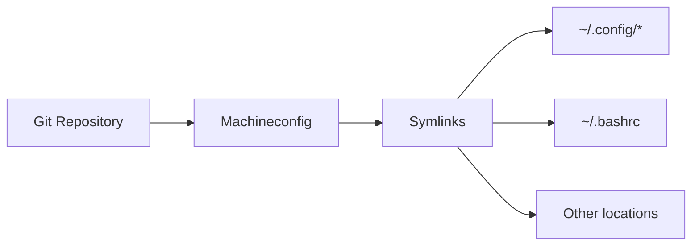

# Dotfiles Management

Synchronize your configuration files across machines.

---

## Overview

Dotfiles are configuration files (usually starting with a dot, like `.bashrc`) that customize your environment. Machineconfig helps you:

- Track dotfiles in version control
- Sync them across machines
- Handle platform-specific variations

---

## Quick Start

### Initialize Dotfiles

```bash
mcfg dotfiles init
```

### Sync Dotfiles

```bash
mcfg dotfiles sync
```

### Push Changes

```bash
mcfg dotfiles push
```

---

## Dotfiles Strategy

Machineconfig uses a flexible approach:



### Benefits

- **Version controlled**: Track all changes
- **Portable**: Works on any machine
- **Secure**: Separate public and private configs
- **Flexible**: Override per-machine as needed

---

## Public vs Private Dotfiles

### Public Dotfiles

Configuration that can be shared publicly:

- Shell aliases
- Editor settings
- Tool configurations

### Private Dotfiles

Sensitive configuration that should stay private:

- API keys
- SSH configurations
- Credentials

```bash
# Sync only public
mcfg dotfiles sync --public

# Sync with private
mcfg dotfiles sync --private
```

---

## Platform-Specific Configuration

Machineconfig handles platform differences automatically:

```
dotfiles/
├── common/           # Shared across all platforms
├── linux/            # Linux-specific
├── macos/            # macOS-specific
└── windows/          # Windows-specific
```

---

## Integration with Cloud Storage

Sync private dotfiles via encrypted cloud storage:

```bash
mcfg dotfiles sync --cloud
```

Supports:

- OneDrive
- Google Drive
- Dropbox
- Any rclone-supported backend

---

## Backup

Create a backup of current dotfiles:

```bash
mcfg dotfiles backup
```

Restore from backup:

```bash
mcfg dotfiles restore
```
