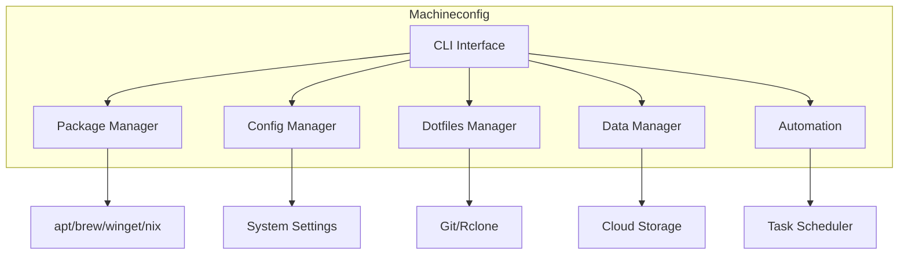

# User Guide Overview

Welcome to the Machineconfig User Guide. This guide covers all the features and functionality of machineconfig.

---

## What is Machineconfig?

Machineconfig is a comprehensive CLI-based stack manager that helps you:

- **Manage packages** across different operating systems
- **Configure systems** with consistent settings
- **Sync dotfiles** between machines
- **Automate tasks** and workflows
- **Handle data** backup and synchronization

---

## Core Concepts

### 1. Cross-Platform Consistency

Machineconfig provides a unified interface across Windows, macOS, and Linux. Write your configuration once and deploy it anywhere.

### 2. Stack-Based Approach

Your "stack" includes:

- CLI tools and packages
- Configuration files (dotfiles)
- Secrets and credentials
- Data and backups
- Code repositories

### 3. Modular Architecture

Each component of machineconfig can be used independently:

- Use just the package manager
- Use just the dotfiles sync
- Or use everything together

---

## Guide Sections

| Section | Description |
|---------|-------------|
| [Package Management](packages.md) | Install and manage software |
| [Configuration](configuration.md) | System configuration |
| [Dotfiles](dotfiles.md) | Manage dotfiles |
| [Data Sync](data-sync.md) | Backup and sync data |
| [Automation](automation.md) | Automate workflows |

---

## Architecture

---

## Getting Help

- Run `mcfg --help` for command help
- Check [CLI Reference](../cli/index.md) for detailed command docs
- Visit [GitHub Issues](https://github.com/thisismygitrepo/machineconfig/issues) for support
