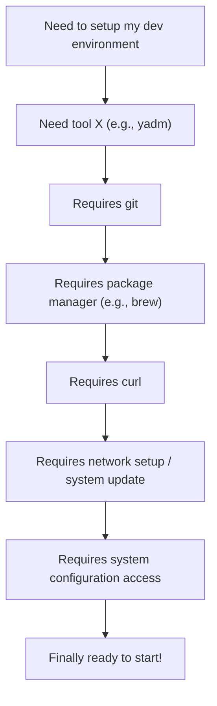

---
hide:
  - navigation
  - toc
---

<style>
.md-content .md-typeset h1 { display: none; }
</style>

<div align="center" markdown>

# **Machineconfig**

### Your Cross-Platform Stack Manager

[](https://pypi.org/project/machineconfig/)
[](https://pypi.org/project/machineconfig/)
[](https://github.com/thisismygitrepo/machineconfig/blob/main/LICENSE)
[](https://github.com/thisismygitrepo/machineconfig/commits)

---

**Machineconfig** is a swiss-army knife CLI tool — a *Package Manager*, *Configuration Manager*, *Automation Tool*, *Dotfiles Manager*, *Data Solution*, and *Code Manager*, all rolled into one seamless cross-platform experience.

[Get Started](installation.md){ .md-button .md-button--primary }
[View on GitHub](https://github.com/thisismygitrepo/machineconfig){ .md-button }

</div>

---

## Why Machineconfig?

Setting up a new machine, VM, or Docker container often involves navigating complex dependency chains:



**Machineconfig** eliminates this complexity by providing a unified tool that:

- :material-package-variant: **Manages packages** across all platforms
- :material-cog: **Configures systems** automatically
- :material-sync: **Syncs dotfiles** seamlessly
- :material-cloud-sync: **Handles data** backup and sync
- :material-robot: **Automates** repetitive tasks

---

## Quick Install

=== "Linux / macOS"

    ```bash
    curl -LsSf https://astral.sh/uv/install.sh | sh  # Skip if UV installed
    uv tool install --upgrade --python 3.14 machineconfig
    ```

=== "Windows"

    ```powershell
    powershell -ExecutionPolicy ByPass -c "irm https://astral.sh/uv/install.ps1 | iex"
    uv tool install --upgrade --python 3.14 machineconfig
    ```

---

## Feature Overview

| Category | Comparable Tools | Description |
|----------|-----------------|-------------|
| **Package Manager** | `winget`, `apt`, `brew`, `nix` | Installs and manages software packages |
| **Configuration Manager** | `Ansible`, `Chef`, `Puppet` | Configures system-level preferences |
| **Automation Tool** | `Airflow`, `Prefect`, `Dagster` | Automates pipelines and orchestration |
| **Dotfiles Manager** | `chezmoi`, `yadm`, `GNU Stow` | Synchronizes personal configs |
| **Data Solution** | `rclone`, `rsync` | Handles backups and file sync |
| **Code Manager** | `Vault`, `strong-box` | Manages secrets and credentials |

---

## One-Line Setup

Get your entire development environment configured with a single command:

=== "Linux / macOS"

    ```bash
    . <(curl -L bit.ly/cfglinux)
    ```

=== "Windows"

    ```powershell
    irm bit.ly/cfgwindows | iex
    ```

This interactive installer guides you through setting up your complete stack in minutes.

---

<div class="grid cards" markdown>

-   :material-rocket-launch:{ .lg .middle } **Getting Started**

    ---

    Install machineconfig and set up your first configuration

    [:octicons-arrow-right-24: Installation](installation.md)

-   :material-book-open-variant:{ .lg .middle } **User Guide**

    ---

    Learn how to use all of machineconfig's features

    [:octicons-arrow-right-24: User Guide](guide/overview.md)

-   :material-console:{ .lg .middle } **CLI Reference**

    ---

    Complete reference for all CLI commands

    [:octicons-arrow-right-24: CLI Reference](cli/index.md)

-   :material-api:{ .lg .middle } **API Reference**

    ---

    Detailed API documentation for developers

    [:octicons-arrow-right-24: API Reference](api/index.md)

</div>
